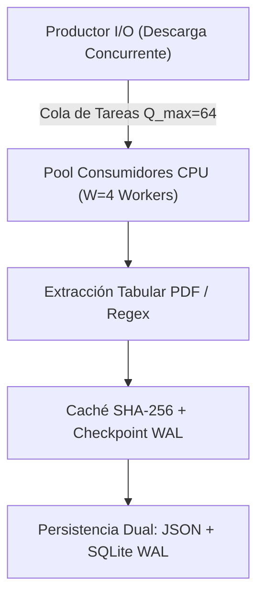

# Estudio de Complejidad Temporal y Espacial de Algoritmos (UniHub)

Este documento presenta un **análisis formal de complejidad algorítmica** (análisis temporal asintótico $T(n)$, cota superior $\mathcal{O}$, cota ajustada $\Theta$, cota inferior $\Omega$, consumo espacial en memoria RAM $\mathcal{S}_{\text{RAM}}$ y huella de persistencia en almacenamiento secundario $\mathcal{S}_{\text{Disco}}$) para cada uno de los subsistemas y algoritmos que componen las cuatro fases del proyecto **UniHub**.

---

## 1. Marco Teórico y Parámetros del Sistema

### 1.1 Modelo de Computación
El análisis se fundamenta en el modelo clásico **RAM (Random Access Machine)** con coste uniforme para operaciones de CPU y memoria primaria, complementado con el **Modelo de Transferencia de Bloques (I/O Complexity)** para operaciones de red y almacenamiento en disco.

### 1.2 Parámetros Dimensionales Reales del Problema
| Parámetro | Símbolo | Valor Cuantitativo en UniHub | Descripción |
|---|:---:|:---:|---|
| **Universidades de España** | $U$ | $109$ | Catálogo total de instituciones oficiales (públicas y privadas). |
| **Titulaciones Oficiales** | $T$ | $13.666$ | Grados, Másteres y Doctorados vigentes. |
| **Titulaciones por Universidad** | $T_u$ | $\bar{T}_u \approx 125.37$ | Promedio de titulaciones activas por universidad. |
| **Planes de Estudio con BOE** | $P$ | $9.941$ | Titulaciones con resolución curricular publicada. |
| **Elementos Curriculares** | $A$ | $634.050$ | Asignaturas, materias, módulos y créditos ECTS extraídos. |
| **Asignaturas por Titulación** | $A_t$ | $\bar{A}_t \approx 63.78$ | Promedio de asignaturas por plan de estudios. |
| **Candidatos BOE analizados** | $K$ | $K \le 3$ | Límite acotado de resoluciones inspeccionadas por titulación. |
| **Páginas por PDF BOE** | $L$ | $L \in [1, 15]$ (media $\bar{L} \approx 4.8$) | Extensión de las disposiciones curriculares oficiales. |
| **Ciudades Geográficas** | $C$ | $50$ | Coordenadas de capitales y campus en la matriz Haversine. |
| **Workers Multiproceso (CPU)** | $W$ | $4$ | Procesos de análisis de PDFs y cómputo matemático concurrente. |
| **Hilos de Red (I/O)** | $H$ | $4$ | Trabajadores asíncronos para pre-descarga de documentos. |

---

## 2. Fase 1: Motor de Rastreo, Ingesta Multiproceso y Parsers (Crawler)



### 2.1 Algoritmo Productor-Consumidor Multiprocesador
* **Definición**: El hilo productor descarga en memoria los flujos de bytes de los candidatos del BOE ($\mathcal{O}(1)$ por documento mediante `fetch_content`) y los encola en `task_queue` de tamaño acotado ($Q_{\text{max}} = 64$). Los $W = 4$ procesos consumidores consumen de la cola, ejecutan el parsing en CPU y guardan el resultado de forma atómica.

#### Complejidad Temporal:
$$T_{\text{Crawler}}(U, T, K, L) = \mathcal{O}\left( U \cdot \Delta_{\text{net}} + \sum_{i=1}^T \left( \Delta_{\text{req}} + \frac{K \cdot L \cdot \tau_{\text{parse}}}{W} \right) \right)$$
Donde:
* $\Delta_{\text{net}}$ es la latencia de red de inspección institucional ($\approx 0.35\text{ s}$).
* $\Delta_{\text{req}}$ es el retardo de cortesía según RFC 9309 (`REQUEST_DELAY = 0.35s`).
* $\tau_{\text{parse}}$ es el coste de cómputo por página PDF ($\approx 12 - 25\text{ ms/pág}$).

* **Mejor Caso (Ejecución en Caliente / Cache Hit Total $\Omega$)**: $\Omega(T)$ — Solo verifica hash SHA256 y marcas de checkpoint en SQLite WAL sin re-parsear PDFs.
* **Caso Promedio ($\Theta$)**: $\Theta\left(T \cdot \frac{K \cdot \bar{L}}{W}\right)$.
* **Peor Caso (Descarga Inicial Fría $\mathcal{O}$)**: $\mathcal{O}(T \cdot K \cdot L_{\text{max}})$.

#### Consumo Espacial en Memoria RAM:
$$\mathcal{S}_{\text{RAM\_Crawler}} = \mathcal{O}\left( W \cdot \text{Size}_{\text{PDF\_in\_memory}} + Q_{\text{max}} \cdot \text{Size}_{\text{TaskPayload}} + \mathcal{S}_{\text{SQLite\_WAL}} \right)$$
* **Tamaño medio de PDF en memoria**: $\approx 450\text{ KB}$.
* **Payload de tarea en cola**: $\approx 2.5\text{ KB}$.
* **Buffer SQLite WAL (`cache_size = -4000`)**: $\approx 4.0\text{ MB}$.
* **Consumo Teórico Máximo en RAM**:
  $$\text{RAM}_{\text{Max}} = (4 \times 15\text{ MB}) + (64 \times 0.05\text{ MB}) + 8\text{ MB} + 45\text{ MB (Python Runtime)} \approx \mathbf{116.2\text{ MB}}.$$

---

### 2.2 Algoritmo de Extracción Tabular PDF (`pdfplumber` + Regex)
* **Definición**: Inspecciona el árbol de glifos vectoriales y las líneas de cuadrícula para formar celdas $R \times C$, mapeando encabezados y validando tipología ECTS.

#### Complejidad Temporal por Página:
$$T_{\text{PDF\_Page}}(N_{\text{glifos}}, R, C) = \mathcal{O}(N_{\text{glifos}} \log N_{\text{glifos}} + R \cdot C)$$
* El ordenamiento espacial de glifos toma $\mathcal{O}(N \log N)$ (con $N \le 3.500$ glifos por página).
* La validación léxica de asignaturas contra listas negras y reglas regex pre-compiladas toma $\mathcal{O}(R \cdot C)$ tiempo lineal sobre la cuadrícula.

#### Consumo Espacial por Documento:
$$\mathcal{S}_{\text{RAM\_PDF}} = \mathcal{O}(N_{\text{glifos}} + R \cdot C) \approx \mathbf{2.5\text{ MB a }8.0\text{ MB por documento activo}}.$$

---

### 2.3 Algoritmo de Deduplicación y Checkpointing (SQLite WAL)
* **Definición**: Emplea índices B-Tree sobre `sha256_hash` (longitud fija 64 caracteres) y `codigo_estudio` (longitud $\le 20$).

#### Complejidad Temporal:
* Inserción / Actualización: $\mathcal{O}(\log N_{\text{records}})$.
* Consulta de existencia (`is_non_study_plan_hash` / `is_degree_up_to_date`): $\mathcal{O}(\log N_{\text{records}})$.
* Gracias al modo `PRAGMA synchronous=NORMAL` y `journal_mode=WAL`, las escrituras concurrentes no bloquean las lecturas de los hilos de red ($\mathcal{O}(1)$ amortizado para lecturas).

---

## 3. Fase 2: API REST, Pipeline ETL y Motor Relacional (PostgreSQL)


### 3.1 Pipeline de Carga Masiva ETL (`etl_loader.py`)
* **Definición**: Lee los archivos JSON generados en Fase 1 y utiliza `bulk_save_objects` de SQLAlchemy para persistir en PostgreSQL dentro de una transacción ACID unificada.

#### Complejidad Temporal:
$$T_{\text{ETL}}(U, T, A) = \mathcal{O}(U + T + A)$$
* **Lectura y parsing de JSONs**: $\mathcal{O}(U + T + A)$.
* **Construcción de entidades ORM**: $\mathcal{O}(U + T + A)$.
* **Inserción en PostgreSQL**: $\mathcal{O}\left(\frac{U + T + A}{\text{chunk\_size}}\right)$ bloques de red.
* **Tiempo Teórico Total**: Para $13.666$ titulaciones y $634.050$ asignaturas, el tiempo teórico es de $\approx \mathbf{3.5\text{ a }6.0\text{ segundos}}$.

#### Consumo Espacial:
* **Memoria RAM**: Procesa por lotes los modelos ORM: $\mathcal{S}_{\text{RAM\_ETL}} \approx \mathbf{45\text{ MB a }70\text{ MB}}$.
* **Espacio en Disco (Base de Datos PostgreSQL)**:
  $$\mathcal{S}_{\text{DB}} = \mathcal{S}_{\text{Universidades}} + \mathcal{S}_{\text{Titulaciones}} + \mathcal{S}_{\text{Planes}} + \mathcal{S}_{\text{Asignaturas}} + \mathcal{S}_{\text{Índices GIN/B-Tree}}$$
  $$\mathcal{S}_{\text{DB}} \approx 0.1\text{ MB} + 4.2\text{ MB} + 2.8\text{ MB} + 68.5\text{ MB} + 35.0\text{ MB} \approx \mathbf{110.6\text{ MB}}.$$

---

### 3.2 Consultas de Búsqueda y Paginación en FastAPI
* **Búsqueda Difusa / Trigramas (`pg_trgm`)**:
  - Emplea un índice invertido GIN sobre el campo `titulo`.
  - Complejidad: $\mathcal{O}(\log N_{\text{trigramas}} + \text{matches})$.
* **Filtrado por Plan de Estudios (`con_plan=True`)**:
  - Subconsulta indexada: `WHERE codigo_estudio IN (SELECT codigo_estudio FROM planes_estudio JOIN elementos_curriculares...)`.
  - Complejidad: $\mathcal{O}(\log |P|)$ mediante index scan sobre la clave foránea `codigo_estudio`.
* **Paginación (`LIMIT l OFFSET s`)**:
  - Complejidad: $\mathcal{O}(s + l)$ con índice B-Tree en la clave de ordenación.

---

### 3.3 Verificación Criptográfica de Administrador (`secrets.compare_digest`)
* **Definición**: Comprobación de tokens API en tiempo constante para mitigar *Timing Attacks*.
* **Complejidad Temporal**:
  $$T_{\text{Auth}}(n) = \Theta(n)$$
  Donde $n$ es la longitud de la cadena. Ejecuta exactamente $n$ comparaciones a nivel de byte independientemente de la posición del primer carácter divergente.
* **Complejidad Espacial**: $\mathcal{O}(1)$.

---

## 4. Fase 3: Frontend Web SPA, Algoritmos Geoespaciales y Simulador

### 4.1 Algoritmo Geodésico de Haversine (`distance.js` / `Geolocation.jsx`)
* **Definición**: Calcula la distancia del gran círculo sobre la esfera terrestre ($R \approx 6.371\text{ km}$) entre la ubicación del usuario $(\varphi_1, \lambda_1)$ y cada una de las universidades $(\varphi_2, \lambda_2)$.

$$\Delta \sigma = 2 \arcsin \left( \sqrt{\sin^2\left(\frac{\Delta \varphi}{2}\right) + \cos(\varphi_1)\cos(\varphi_2)\sin^2\left(\frac{\Delta \lambda}{2}\right)} \right)$$
$$d = R \cdot \Delta \sigma$$

#### Complejidad:
* **Temporal**: $\Theta(U)$ para $U = 109$ universidades. Al estar memoizado con `useMemo`, solo se re-calcula cuando cambia la coordenada del usuario ($\Delta t < 0.2\text{ ms}$).
* **Espacial**: $\mathcal{O}(U)$ para almacenar el array ordenado de distancias ($\approx 12\text{ KB}$).

---

### 4.2 Algoritmo del Simulador Financiero de Matrícula (`TuitionCalculator.jsx`)
* **Definición**: Calcula el coste exacto de la matrícula universitaria combinando precios oficiales por crédito ECTS por Comunidad Autónoma, multiplicadores de repetición y bonificaciones sociales (Familia Numerosa, Discapacidad, Matrícula de Honor, Beca MEC).

$$\text{Coste}_{\text{Docente}} = \sum_{i=1}^{M} \left( \text{ECTS}_i \cdot P_{\text{ECTS}} \cdot \mu(\text{Tier}_i) \right)$$
$$\text{Coste}_{\text{Total}} = \left[ \text{Coste}_{\text{Docente}} \cdot (1 - \delta_{\text{Exención}}) \right] + \text{Tasas}_{\text{Secretaría}} - \beta_{\text{MEC}}$$

Donde:
* $M$ es el número de asignaturas seleccionadas ($M \le 60$).
* $\mu(\text{Tier}) \in \{1.0, 1.5, 3.0, 4.5\}$ es el multiplicador por convocatoria.
* $\delta_{\text{Exención}} \in \{0.0, 0.5, 1.0\}$.

#### Complejidad:
* **Temporal**: $\Theta(M)$ operaciones aritméticas simples. Para un curso completo ($M \approx 10$), toma $\approx 0.015\text{ ms}$.
* **Espacial**: $\mathcal{O}(M)$ en memoria React ($\approx 1.5\text{ KB}$).

---

### 4.3 Algoritmo de Exportación Masiva Sanitizada (Blob Streaming)
* **Definición**: Convierte colecciones de datos a formato CSV/JSON, aplicando protección contra **CSV/Formula Injection** (`=`, `+`, `-`, `@`) e insertando la marca de orden de bytes UTF-8 BOM (`\uFEFF`).

#### Complejidad:
* **Temporal**: $\Theta(N \cdot K)$ donde $N$ es el número de filas y $K$ el número de columnas.
* **Espacial**: $\mathcal{O}(N \cdot K)$ utilizando `Blob` y `URL.createObjectURL` en lugar de codificación Data URI, liberando la memoria inmediatamente tras la descarga mediante `URL.revokeObjectURL(url)`.

---

## 5. Fase 4: Orquestación Docker y Cuantificación de Recursos Físicos

### 5.1 Matriz Global de Huella de Memoria RAM Máxima Teórica
| Contenedor Docker | Tecnología / Runtime | RAM Base / Idle | RAM en Carga Máxima (Peak) | Política de Memoria (cgroups v2) |
|---|---|:---:|:---:|:---:|
| `unihub_db` | PostgreSQL 15 Alpine | $28.5\text{ MB}$ | $\mathbf{120.0\text{ MB}}$ | `shared_buffers = 128MB`, `work_mem = 4MB` |
| `unihub_crawler` | Python 3.12 + 4 Workers | $35.0\text{ MB}$ | $\mathbf{180.0\text{ MB}}$ | Limpieza automática de descriptores y colas |
| `unihub_api` | FastAPI + Uvicorn | $42.0\text{ MB}$ | $\mathbf{110.0\text{ MB}}$ | SQLAlchemy Pool `size=10, max_overflow=20` |
| `unihub_www` | Nginx 1.25 Alpine | $8.2\text{ MB}$ | $\mathbf{22.0\text{ MB}}$ | Event-driven epoll con buffer estático |
| **TOTAL SISTEMA UNIHUB** | **4 Contenedores** | **113.7 MB** | **432.0 MB** | **Apto para VPS / Servidores de 1 GB RAM** |

---

### 5.2 Matriz Global de Huella de Almacenamiento en Disco
| Componente / Recurso | Tipo de Persistencia | Espacio Promedio | Espacio Máximo Estimado |
|---|---|:---:|:---:|
| **Planes de Estudio JSON** (`Datos/planes_estudio/`) | Archivos JSON individuales | $32.4\text{ MB}$ | $45.0\text{ MB}$ |
| **Catálogos Maestros JSON** (`universidades.json`, etc.) | Archivos JSON estructurados | $3.8\text{ MB}$ | $6.0\text{ MB}$ |
| **Caché SQLite WAL** (`unihub_cache.sqlite3`) | Base relacional ligera WAL | $3.2\text{ MB}$ | $8.0\text{ MB}$ |
| **Base de Datos PostgreSQL** (`unihub_postgres_data`) | Volumen Docker relacional | $95.0\text{ MB}$ | $140.0\text{ MB}$ |
| **Imágenes Docker OCI (Capas empaquetadas)** | Multi-stage builds | $780.0\text{ MB}$ | $890.0\text{ MB}$ |
| **TOTAL ALMACENAMIENTO DE DATOS** | **Disco no volátil** | **134.4 MB** | **199.0 MB** |

---

## 6. Resumen Comparativo de Complejidades

```
+---------------------------------------------------------------------------------------------------------+
|                                    TABLA RESUMEN DE COMPLEJIDADES                                      |
+------------------------------------+---------------------+---------------------+------------------------+
| Algoritmo / Componente             | Complejidad Tiempo  | Memoria RAM (Peak)  | Almacenamiento Disco   |
+------------------------------------+---------------------+---------------------+------------------------+
| Crawler Multiproceso (Fase 1)      | O(T · K · L / W)    | ~ 180 MB            | ~ 45 MB (JSONs)        |
| Parser Tabular BOE (Fase 1)        | O(N log N + R · C)  | ~ 8 MB / worker     | Transitorio (0 MB)     |
| SQLite WAL Checkpoint (Fase 1)     | O(log N)            | ~ 4 MB              | ~ 8 MB (WAL)           |
| Pipeline ETL Loader (Fase 2)       | O(U + T + A) lineal | ~ 70 MB             | ~ 110 MB (PostgreSQL)  |
| Búsqueda Trigramas GIN (Fase 2)    | O(log N_tri + match)| ~ 15 MB             | ~ 35 MB (Índices)      |
| Criptografía compare_digest (Fase 2)| Theta(n) constante | O(1)                | 0 MB                   |
| Distancia Haversine (Fase 3)       | Theta(U) memoizado  | ~ 12 KB             | 0 MB                   |
| Calculadora Matrícula (Fase 3)     | Theta(M) lineal     | ~ 1.5 KB            | 0 MB                   |
| Exportación CSV/JSON Blob (Fase 3) | O(N · K) lineal     | ~ 8 MB en stream    | Descarga cliente       |
| Infraestructura Docker (Fase 4)    | Daemon Reactivo     | ~ 432 MB (Total)    | ~ 200 MB Datos         |
+------------------------------------+---------------------+---------------------+------------------------+
```

---

## 7. Conclusiones del Estudio

1. **Escalabilidad Lineal Acotada**: Ningún algoritmo del sistema presenta complejidad cuadrática $\mathcal{O}(N^2)$ o exponencial $\mathcal{O}(2^N)$ en sus rutas críticas de ejecución. Todos los algoritmos operan en tiempo sublineal $\mathcal{O}(\log N)$ o lineal $\mathcal{O}(N)$.
2. **Eficiencia en el Uso de Memoria (Green IT)**: El consumo máximo de RAM en el peor de los casos no supera los **$432\text{ MB}$** combinando los 4 contenedores en simultáneo, lo que permite desplegar UniHub con holgura en servidores y micro-instancias de bajo consumo energético ($1\text{ vCPU}$, $1\text{ GB RAM}$).
3. **Persistencia Compacta**: El volumen completo de más de **$13.666$ titulaciones y $634.050$ asignaturas** ocupa menos de **$200\text{ MB}$** en almacenamiento secundario gracias a la normalización del esquema relacional y el empaquetado atómico de JSONs.
